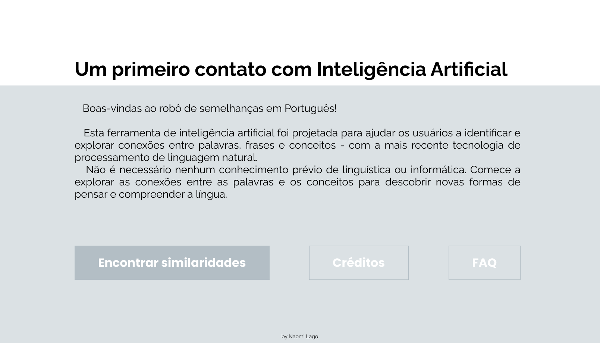
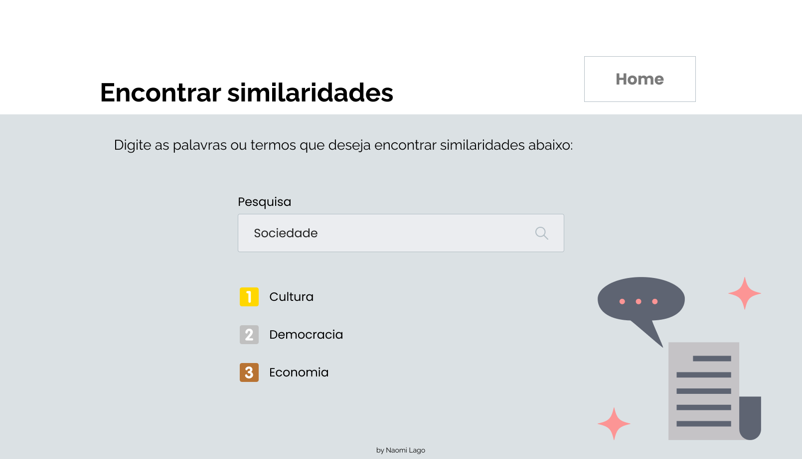

# Buscador de similaridades
&nbsp;

&nbsp;&nbsp;&nbsp;&nbsp;&nbsp;Boas-vindas ao robô de semelhanças em Português!

&nbsp;&nbsp;&nbsp;&nbsp;&nbsp;Esta ferramenta de inteligência artificial foi projetada para ajudar os usuários a identificar e explorar conexões entre palavras, frases e conceitos - com a mais recente tecnologia de processamento de linguagem natural.

&nbsp;&nbsp;&nbsp;&nbsp;&nbsp;Não é necessário nenhum conhecimento prévio de linguística ou informática. Comece a explorar as conexões entre as palavras e os conceitos para descobrir novas formas de pensar e compreender a língua.

## Capturas de tela

## Tecnoloias

**Bibliotecas:** Pandas, Numpy, Sklearn, Gensim, NLTK

**Linguagens:** Python, JavaScript

**Hospedagem:** Hostinger

## Paleta de cores

| Color             | Hex                                                                |
| ----------------- | ------------------------------------------------------------------ |
| Preto |  #000000 |
| Cinza 1 |  #5E6472 |
| Cinza 2 |  #B3BEC5 |
| Cinza 3 |  #C0C0C0 |
| Cinza 4 |  #C5C3C6 |
| Cinza 5 |  #BEC9CF |
| Prata |  #DBE1E4 |
| Ouro |  #FFD700 |
| Cobre |  #B87333 |
| Salmão |  #FC9595 |
